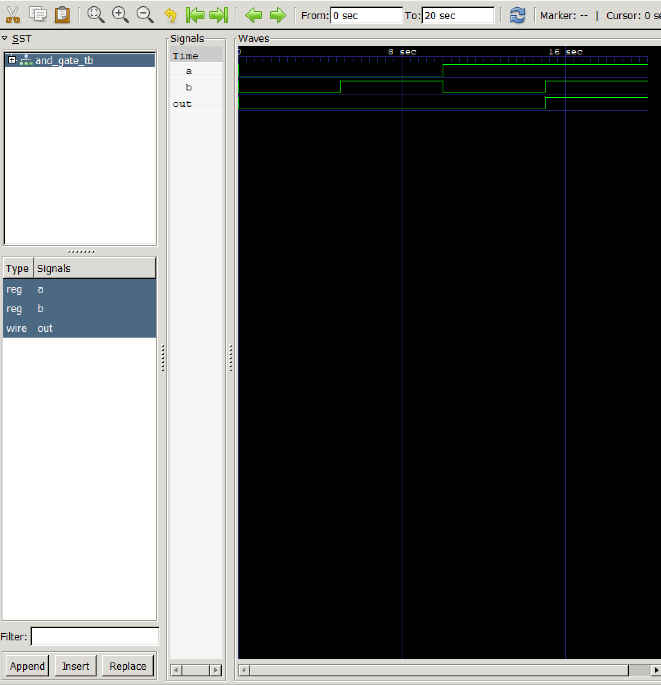

# Waveform Test (Icarus Verilog + GTKWave)

This is a simple test module to verify that my Verilog toolchain (Icarus Verilog + GTKWave) is working correctly.

## Files
- `and_gate.v` – Simple 1-bit AND gate
- `and_gate_tb.v` – Testbench that toggles inputs
- `and_gate.vcd` – Waveform file generated from simulation

## How to Run
iverilog -o and_gate and_gate.v and_gate_tb.v
vvp and_gate
gtkwave and_gate.vcd

## Screenshot
